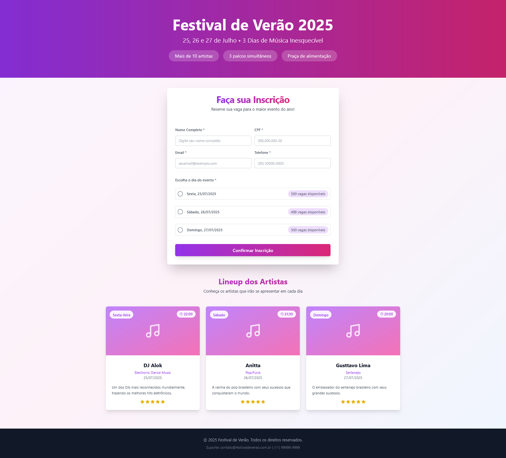
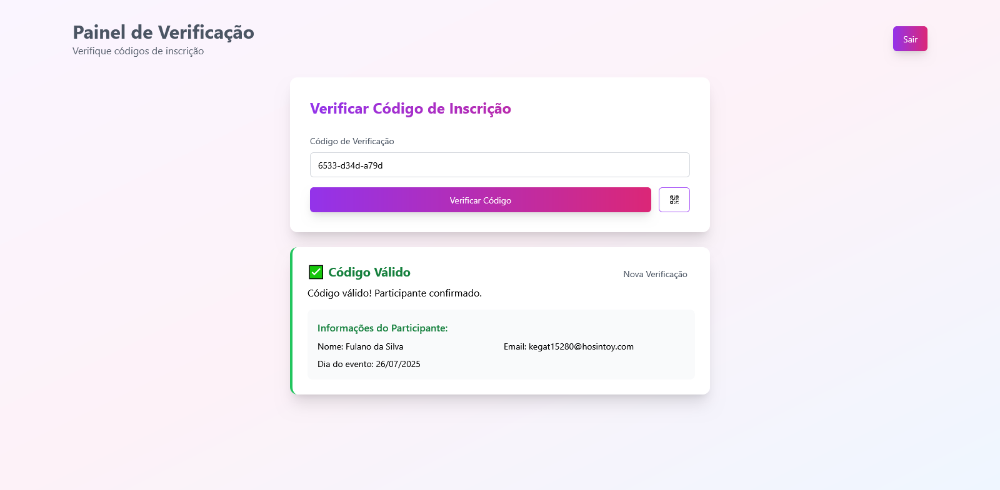
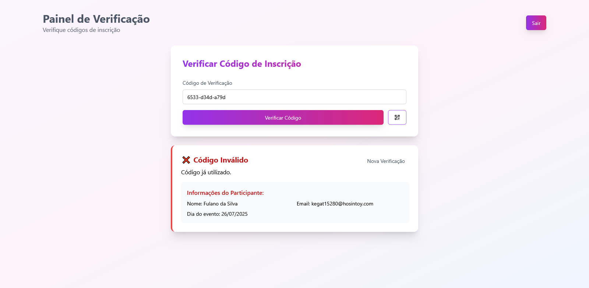
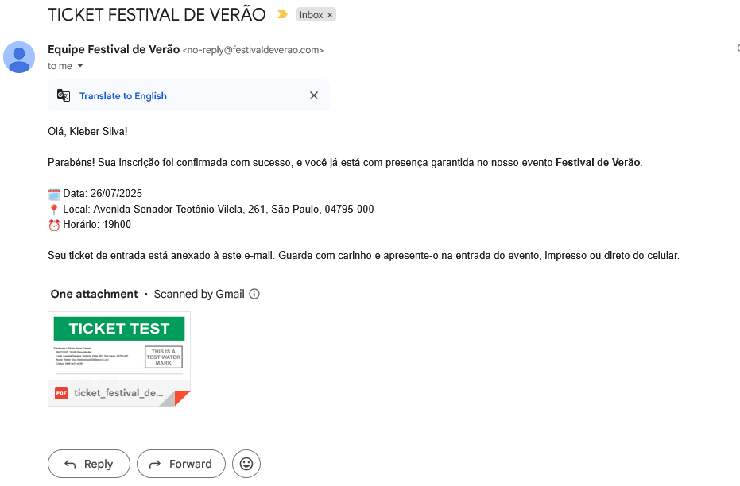

<<<<<<< HEAD
# E-Ticket Platform

**E-Ticket Platform** is a modern and simple web application that allows users to register for a event and automatically receive a personalized **e-ticket in PDF format** via email — complete with event details, QR code, and validation system for event organizers.

> Ideal for small to medium-sized events that require secure ticket validation without complex infrastructure.

---

## 📌 Features

- ✅ User registration form with validation
- 📧 Automatic email delivery of e-ticket (PDF + QR code)
- 🎫 Unique QR code generated for each ticket
- 🖨️ Dynamic PDF generation with user & event info
- 🎥 Admin dashboard to **scan or manually validate** e-tickets
- 🔐 Validation system checks if a ticket is:
  - **Valid or invalid**
  - **Already used or not**
- 📱 Mobile camera integration for QR code scanning

---

## 🚀 Technologies Used

| Stack         | Tech Description                                        |
|---------------|----------------------------------------------------------|
| **Frontend**  | React · TypeScript · Vite · Radix UI · Lucide Icons     |
| **Validation**| Zod for schema validation                               |
| **Email**     | Resend API for email delivery     |
| **PDF Gen**   | pdf-lib for dynamic PDFs     |
| **QR Code**   | qrcode for generation |
| **QR Scanner**| html5-qrcode for camera input |
| **Database**  | Supabase for backend storage   |
| **Infra**     | Netlify (Functions for backend + frontend hosting)      |

---

## 📷 Screenshots






[See e-ticket PDF Exaple](docs/ticket_festival_de_verao.pdf)

---

## ⚙️ Environment Variables

Create a `.env` file with:

```
DATABASE_URL = "url"
DATABASE_KEY = "key"

RESEND_API_KEY = "RESEND_KEY"

LOGIN = "login"
PASSW = "password"
```

---

## 📦 Installation

Clone the repository, install dependencies and run the dev server.

```bash
git clone https://github.com/Raqui333/eticketplataform.git
cd eticketplataform
npm install
netlify dev
```

---

## 🛠️ Project Structure

```
/public               # App assets
/src         
 ├── components       # UI components (form, login, etc.)
 ├── hooks            # App hooks
 ├── lib              # Utils
 ├── pages            # Main routes (home, panel, etc.)

/netlify
 ├── functions        # Serverless backend (PDF generation, QR code, API, etc.)
```

---

## 🔐 Admin Panel

The admin interface helps event staff:

- Scan QR codes via camera
- Manually input QR codes
- Instantly see participant data
- Track ticket usage (used vs. unused)
- Prevent duplicate entries

---

## 📧 E-Ticket Example

Each user receives:

- A **PDF ticket** with:
  - Name and contact
  - Event name and details
  - Unique QR code
- Email is sent immediately after registration using **Resend API**

---

## 🌐 Deployment

This project is deployed using Netlify with:

- **Frontend**: React app hosted as a static site
- **Backend**: Serverless Functions (Netlify Functions) for ticket validation and email handling
=======
# eticketplataform
A e-ticket web platform for generating, managing, and verifying digital tickets — designed for private events, internal systems, or controlled access scenarios. No payment or selling features involved.
>>>>>>> 0af9fa7790207e318232c2b7e5227d022b89b479
